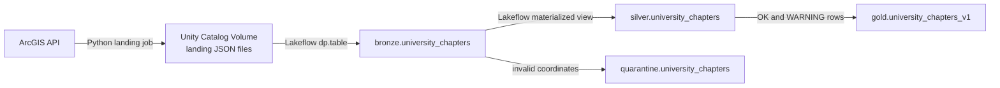

# University Chapters Pipeline

## Tables

| Table | Sample row |
|---|---|
| `bronze.university_chapters` | `run_id`, `source_url`, `ingested_at`, `raw_payload` |
| `silver.university_chapters` | `CA-0355`, `Example University`, `Los Angeles`, `CA`, `OK` |
| `quarantine.university_chapters` | `CA-9102`, `not-a-number`, `INVALID_COORDINATES` |
| `gold.university_chapters_v1` | `CA-0355`, `Example University`, `Los Angeles`, `CA`, `OK` |

## Run in Azure Databricks

1. Create a Unity Catalog Volume: `<catalog>.bronze.api_landing`.
2. Run `pipelines/land_api_payload.py` from a notebook or job to write an API JSON file into the Volume.
3. Open **Jobs & Pipelines** → **Create** → **ETL pipeline**.
4. Add `pipelines/bronze_ingestion.py`, `pipelines/silver_ingestion.py`, and `pipelines/gold_ingestion.py`.
5. Set `university_chapters.landing_path` to `/Volumes/<catalog>/bronze/api_landing/university_chapters/`.
6. Select **Run pipeline**.

## Architecture

1. A Databricks notebook or job calls the API and writes one JSON file per run to a Unity Catalog Volume.
2. The Lakeflow Bronze table reads those landed files with Auto Loader.
3. Silver parses the raw JSON, cleans it, deduplicates it, and separates invalid coordinates into Quarantine.
4. Gold contains only clean and warning rows for consumers.
